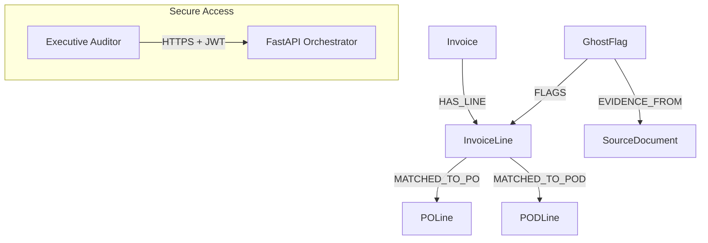

# 🕵️ Sentinel — Liquid Enterprise OS (Phase 1 POC)

**Sentinel** is a "Liquid Enterprise OS" designed to decouple enterprise data from application silos. This POC ("The Walking Skeleton") implements **"The Ghost Invoice"** reconciliation pipeline, identifying financial leakage across conflicting JSON, CSV, and XML datasets.

---

## 🏗️ Technical Stack & Verified Versions

*   **Runtime**: Python 3.12-slim
*   **Database**: Neo4j 2026.01.4 (Graph Database with GDS)
*   **API Framework**: FastAPI v0.3.0
*   **LLM Engine**: Gemini 2.5 Flash (google-genai SDK v1.65.0)
*   **Security**: HTTPS/TLS + JWT (JSON Web Token) Identification
*   **Fuzzy Matching**: RapidFuzz (High-performance C++ backend)
*   **XML Engine**: lxml v6.0.2 (required for exact line-number provenance)
*   **Testing**: Pytest 9.0.2 with pytest-cov v7.0.0

---

## 🚀 Quick Start (Sub-2s Execution for 10k Rows)

If you have Docker and Python installed, you can execute the entire end-to-end pipeline (Setup → Build → Ingest → Grade → Teardown) with a single command:

```bash
export GEMINI_API_KEY="your_api_key"
make e2e
```

---

## 🛠️ Detailed Operational Guide

### 1. Prerequisites & Installation
Ensure you are in a clean virtual environment:

```bash
make install
source venv/bin/activate  # Or Scripts\activate on Windows
```

### 2. Environment Orchestration
Sentinel uses Docker Compose to manage the graph infrastructure and API server:

```bash
make up          # Spin up Neo4j and FastAPI
make verify-db   # Validate connectivity and GDS/APOC status
```

### 3. Running the Pipeline
You can process single datasets or run the full batch mode required for the external grader:

```bash
# Process all dirty datasets for grading
make run-batch

# Run the external grader (requires reports to be generated)
python tests/grader.py --datasets data/sentenil_dirty_datasets --reports output/reports --out output/
```

### 4. API & Natural Language Querying (NLQ)
The system exposes a secure REST API for real-time reconciliation and graph analysis.

*   **Interactive Docs**: [https://localhost:8000/docs](https://localhost:8000/docs)
*   **NLQ Endpoint**: `POST /query` (Secure)
*   **Dashboard Metrics**: `POST /dashboard/metrics` (Secure)

### 5. Security & Authentication
As of Phase 1 completion, full authentication is enforced. 
- **Identity**: `admin`
- **Access Key**: `sentinel2026`
- **Protocol**: All traffic must be over **HTTPS**. Accept the self-signed certificate in your browser to proceed.

---

## 🧪 Testing & Quality Enforcement

Sentinel enforces a **90% minimum code coverage** threshold via `pytest.ini`.

```bash
make test-unit         # Atomic tests (mocked Gemini/Neo4j)
make test-integration  # Tests against running Docker containers
make test              # Full suite with coverage report
```

---

## 🔍 Architecture Overview

### Modular Components
*   **Ingestor** (`sentinel/core/ingest.py`): Uses `lxml` to preserve physical line numbers for the **"Evidence Chain."**
*   **Logic Engine** (`sentinel/core/match.py`): Implements a high-velocity layered strategy (**Exact → RapidFuzz → Gemini-2.5-Flash**).
*   **Graph Engine** (`sentinel/core/graph.py`): Uses batch `UNWIND` Cypher operations for high-performance ingestion.
*   **NLQ Engine** (`sentinel/core/nlq.py`): Secure, read-only Text-to-Cypher translation for non-technical auditors.

### Graph Schema


---

## 📄 Documentation Index
- [Phase 1 Summary](docs/phase_1_summary.md)
- [Performance & Compliance Verification v1.4](docs/phase1_compliance_verification_v1_3.md)
- [Status Report: 10k Row Stress Test](docs/phase_1_status_report.md)
- [Technical Architecture v2.0](docs/sentinel_architecture_v2_0.md)
- [Security & Auth Protocol](docs/security_and_auth_v1_0.md)

---

## 🧹 Cleanup

To reset the environment and purge all persisted graph data:

```bash
make clean
```

---

### 👤 Author
**Crispin Courtenay** - crispin.courtenay@gmail.com

> [!IMPORTANT]
> **High-Velocity Engineering Note**: For local development, use `make serve` to run the FastAPI server with hot-reloading enabled. All code must pass the `make test` suite before merging into main to satisfy the **GitHub Actions CI pipeline**.
