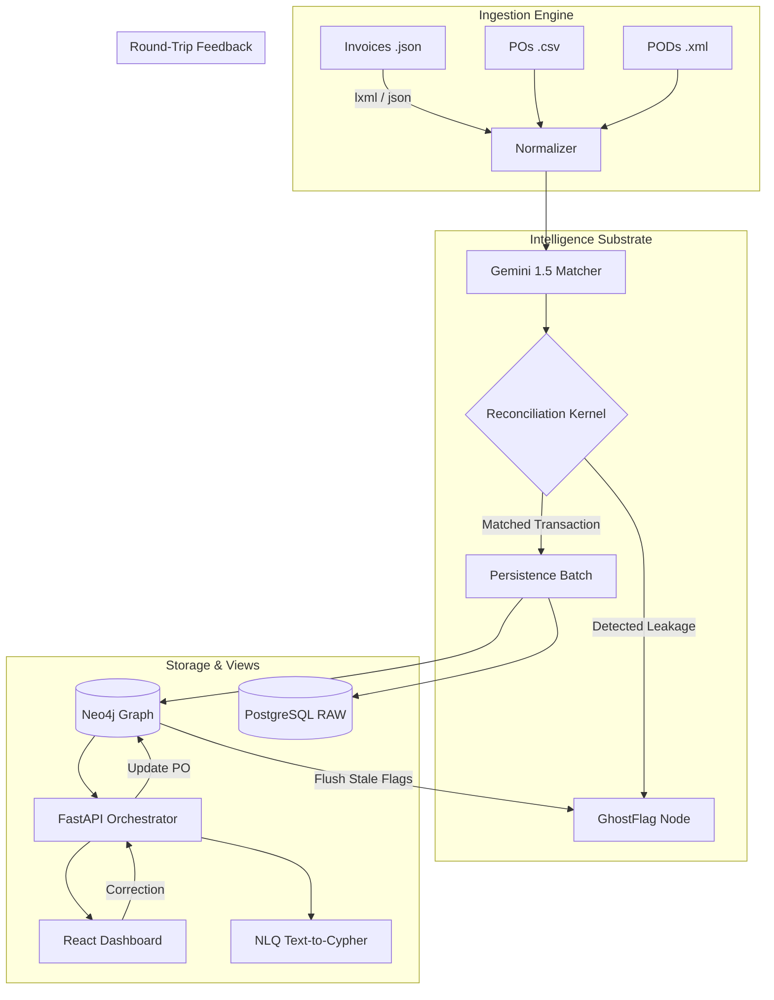

# 🛡️ Sentinel Liquid Enterprise OS: Technical Architecture v2.0

## 1. Executive Summary
Sentinel is a **Liquid Enterprise OS** designed to decouple critical procurement data from siloed applications. It transforms static, fragmented records (Invoices, POs, PODs) into a dynamic, omni-directional **Knowledge Substrate**. The system specializes in forensic audit automation, specifically the detection of **"Ghost Invoices"**—billing leakage where line items are either non-existent, over-authorized, or mismatching physical delivery state.

---

## 2. Core Architectural Pillars

### A. High-Fidelity Ingestion Layer
The ingestion engine is designed for **Forensic Traceability**. Unlike standard parsers, Sentinel preserves the physical provenance of every data point.
- **JSON (Invoices)**: Recursive parsing of nested line items and metadata.
- **CSV (Purchase Orders)**: Header-flexible normalization with case-insensitive mapping.
- **XML (Proof of Delivery)**: Utilizing `lxml` to capture exact `.sourceline` attributes, pinning every delivery receipt to a line-level physical coordinate.

### B. Multi-Modal Matching Logic
The "Stitching" kernel uses a 3-layer resolution strategy to ensure maximum liquidity:
1.  **Exact Match**: Hash-based lookup for standardized SKUs.
2.  **Fuzzy Logic**: Levenshtein distance/Jaccard similarity for typographical variances in descriptions.
3.  **LLM Resolution (Gemini 1.5 Flash)**: A "Matching Logic" assistant that maps disparate inventory identifiers to a canonical ID using context-aware semantics.

### C. The Graph Substrate (Neo4j)
Sentinel's brain is a **Neo4j 2026.01.4** instance. It uses a high-velocity **Batch UNWIND** strategy to persist thousands of transactions in sub-second windows.
- **Entities**: `Vendor`, `Invoice`, `InvoiceLine`, `PurchaseOrder`, `POLine`, `Delivery`, `GhostFlag`.
- **Topologies**: Supports recursive item hierarchies (`IS_CHILD_OF`) for Complex Bill of Materials (BOM) analysis.
- **GDS Integration**: Built-in support for Degree Centrality and WCC (Weakly Connected Components) to identify high-risk vendor clusters.

---

## 3. The "Ghost Invoice" Detection Engine
The system autonomously detects five primary leakage patterns:
1.  **PHANTOM_LINE**: Invoiced items with no matching Purchase Order authorization.
2.  **PO_PRICE_VARIANCE**: Unit prices exceeding the contractually agreed rate.
3.  **QUANTITY_MISMATCH**: Billed quantities exceeding either authorized or physically delivered amounts.
4.  **RECURSIVE_GHOSTS**: Discrepancies inherited from child components in a hierarchical structure.
5.  **UNRECONCILED_DELIVERY**: Physical stock received but never correctly billed or authorized.

---

## 4. System Flow & Connectivity

---

## 5. Technology Stack
- **Engine**: Python 3.12 (Strictly typed, Async).
- **Substrate**: Neo4j 2026.01.4 (with GDS & APOC).
- **Storage**: PostgreSQL 18.0 (Relational raw store).
- **Intelligence**: Google Gemini 1.5 Flash SDK.
- **Frontend**: React 19 + Vite + Tailwind CSS 4.0 + Framer Motion.
- **Gateway**: Bifrost MCP (Model Context Protocol) for Natural Language triggering.

---

## 6. Phase 2: The "Steel Thread" (Round-Trip)
A critical feature of v2.0 is the **Propagation Loop**. 
- **Endpoint**: `POST /graph/update-po`
- **Logic**: When an external user (Auditor) corrects a data point (e.g., updates a PO Price via the Dashboard), the change propagates to the graph. The system then automatically **invalidates/deletes associated GhostFlags**, allowing the substrate to "heal" in real-time as corrections are made.

---

## 7. Directory & Project Structure
- `/sentinel/core`: The pure logic engine (Ingest, Match, Detect, Graph).
- `/backend`: The Dockerized microservice architecture.
- `/frontend`: The high-fidelity React dashboard.
- `/docs`: Forensic evidence, architectural decision records (ADRs), and compliance reports.
- `/data`: Normalized data stores and "Dirty" datasets for testing.
- `/scripts`: Tooling for dataset scaffolding and GDS triggering.

---

---

## 9. Secure Forensic Operations (HTTPS & Auth)
As of v2.0, Sentinel enforces strict end-to-end encryption and mandatory authentication:
- **Transport Security**: Both Frontend (Vite) and Backend (FastAPI/Uvicorn) operate over **HTTPS/TLS**.
- **Authentication**: Mandatory **JWT (JSON Web Token)** flow for all substrate interactions.
- **Identity Provider**: Built-in credential management with password-protected executive access.
- **Session Management**: Secure browser storage of access tokens for persistent forensic session state.

---
*Generated by Antigravity AI — Sentinel System Architect*
